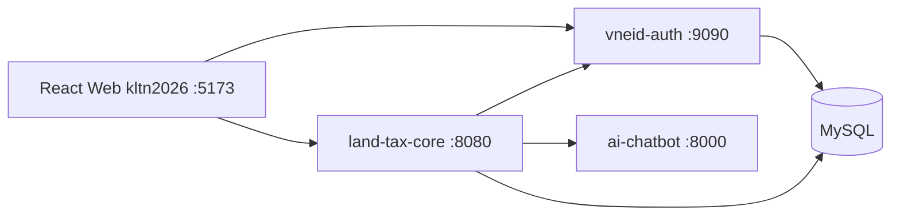

# Xây dựng hệ thống Quản lý Đất đai và Thuế đất tích hợp xác thực VNeID

Dự án khóa luận tốt nghiệp — nền tảng hỗ trợ **công dân** khai báo và nộp hồ sơ thuế đất, **cán bộ địa chính** tiếp nhận & đối chiếu sổ, **cán bộ thuế** xử lý và thu tiền, kèm **xác thực VNeID**, **thanh toán PayOS** và **chatbot AI** tư vấn pháp luật đất đai.

> **Lưu ý:** Dự án chỉ dùng cho môi trường phát triển / demo học tập. Không triển khai production với cấu hình mặc định.

---

## Mục lục

- [Kiến trúc](#kiến-trúc)
- [Công nghệ](#công-nghệ)
- [Vai trò người dùng](#vai-trò-người-dùng)
- [Yêu cầu hệ thống](#yêu-cầu-hệ-thống)
- [Cài đặt](#cài-đặt)
- [Chạy ứng dụng](#chạy-ứng-dụng)
- [Cấu trúc thư mục](#cấu-trúc-thư-mục)
- [Luồng nghiệp vụ](#luồng-nghiệp-vụ-chính)
- [Biến môi trường](#biến-môi-trường)
- [API](#api)
- [Bảo mật khi public](#bảo-mật-khi-public-repo)
- [Xử lý sự cố](#xử-lý-sự-cố-thường-gặp)

---

## Kiến trúc



| Thành phần | Thư mục | Port |
|------------|---------|------|
| Frontend web | `kltn2026/` | `5173` |
| VNeID Auth | `vneid-auth/` | `9090` |
| Land Tax Core API | `land-tax/land-tax/land-tax-core-main/` | `8080` |
| AI Chatbot (RAG) | `ai-chatbot-service/` | `8000` |
| MySQL | `database/` (script SQL) | `3306` |
| App VNeID (Android) | `AppVneID/` | — |

---

## Công nghệ

| Layer | Stack |
|-------|--------|
| Frontend | React 19, Vite, React Router, Bootstrap |
| Backend | Spring Boot 3, Java 17, Spring Security, JPA |
| Auth | JWT, VNeID simulator, Gmail OTP |
| AI | FastAPI, LangChain, Google Gemini, FAISS |
| DB | MySQL 8 |
| Upload | Cloudinary |
| Thanh toán | PayOS |

---

## Vai trò người dùng

| Role | Màn hình chính |
|------|----------------|
| `ROLE_CITIZEN` | Khai báo thuế, nộp hồ sơ, thanh toán, chatbot |
| `ROLE_LAND_OFFICER` | Xử lý hồ sơ địa chính, khiếu nại đất |
| `ROLE_TAX_OFFICER` | Tiếp nhận hồ sơ thuế, duyệt, quản lý thanh toán |
| `ROLE_ADMIN` | Quản trị người dùng, lịch sử thao tác, cấu hình |

---

## Yêu cầu hệ thống

- **Java 17+** và **Maven 3.8+**
- **Node.js 18+** và **npm**
- **Python 3.10+** (cho chatbot)
- **MySQL 8**
- **Git**

Tài khoản dịch vụ (tuỳ tính năng cần dùng):

- Gmail App Password (gửi OTP)
- Cloudinary (upload tài liệu hồ sơ)
- PayOS (thanh toán trực tuyến)
- Google Gemini API (chatbot)

---

## Cài đặt

### 1. Clone repository

```powershell
git clone https://github.com/khackhanh1201/KHOA_LUAN_TOT_NGHIEP_NHOM_9.git
cd Khoa_luan_10d
```

### 2. Cấu hình biến môi trường

```powershell
copy .env.example .env
```

Mở `.env` và điền giá trị thật. Hai biến **bắt buộc trùng nhau** giữa `vneid-auth` và `land-tax`:

- `JWT_SECRET`
- `INTERNAL_API_SECRET`

File `.env` **không được commit** lên Git (đã có trong `.gitignore`).

### 3. Tạo database MySQL

```sql
CREATE DATABASE `vneid` CHARACTER SET utf8mb4 COLLATE utf8mb4_unicode_ci;
CREATE DATABASE `land-tax` CHARACTER SET utf8mb4 COLLATE utf8mb4_unicode_ci;
```

Import schema và dữ liệu mẫu từ thư mục `database/`:

| File | Database |
|------|----------|
| `vneid_simulator (0).sql` | `vneid` |
| `land_tax_management (0).sql` | `land-tax` |
| `seed_e2e_full_demo.sql` | `land-tax` (tuỳ chọn — dữ liệu demo E2E) |
| `seed_annual_tax_demo_001201000011.sql` | `land-tax` (tuỳ chọn — demo thuế hằng năm) |

Có thể import bằng MySQL Workbench, DBeaver hoặc CLI:

```powershell
mysql -u root -p vneid < "database/vneid (2).sql"
mysql -u root -p land-tax < "database/land-tax (2).sql"
```

### 4. Cài dependency Frontend

```powershell
cd kltn2026
npm install
cd ..
```

### 5. Cài dependency AI Chatbot (tuỳ chọn)

```powershell
cd ai-chatbot-service
python -m venv venv
.\venv\Scripts\Activate.ps1
pip install -r requirements.txt
cd ..
```

---

## Chạy ứng dụng

Cần **4 terminal** (hoặc 3 nếu không dùng chatbot). Thứ tự khuyến nghị: MySQL → VNeID Auth → Land Tax → Chatbot → Frontend.

### Cách nhanh — dùng script PowerShell (Windows)

```powershell
# Terminal 1
.\scripts\run-vneid-auth.ps1

# Terminal 2
.\scripts\run-land-tax.ps1

# Terminal 3 (tuỳ chọn)
.\scripts\run-chatbot.ps1

# Terminal 4
cd kltn2026
npm run dev
```

Script tự gọi `scripts/load-env.ps1` để nạp biến từ `.env`.

### Cách thủ công

```powershell
# Nạp env một lần mỗi terminal
. .\scripts\load-env.ps1

# VNeID Auth
cd vneid-auth
mvn spring-boot:run

# Land Tax Core (terminal khác)
cd land-tax\land-tax\land-tax-core-main
mvn spring-boot:run

# Chatbot (terminal khác)
cd ai-chatbot-service
.\venv\Scripts\Activate.ps1
uvicorn main:app --reload --reload-dir app --port 8000

# Frontend (terminal khác)
cd kltn2026
npm run dev
```

### Truy cập

| Dịch vụ | URL |
|---------|-----|
| Web app | http://localhost:5173 |
| Land Tax API | http://localhost:8080/api |
| VNeID Auth API | http://localhost:9090/api |
| AI Chatbot | http://localhost:8000 |

### IntelliJ / IDE

Trong Run Configuration của từng Spring Boot app, thêm **Environment variables** (copy từ `.env`) hoặc chạy `load-env.ps1` trong terminal IDE trước khi start.

---

## Cấu trúc thư mục

```
Khoa_luan_10d/
├── kltn2026/                      # Frontend React (Vite)
├── vneid-auth/                    # Microservice đăng nhập VNeID, JWT, OTP
├── land-tax/land-tax/
│   └── land-tax-core-main/        # API nghiệp vụ: hồ sơ, thuế, địa chính, PayOS
├── ai-chatbot-service/            # Chatbot RAG pháp luật đất đai
├── AppVneID/                      # Ứng dụng Android VNeID (tuỳ chọn)
├── database/                      # Script SQL schema & seed
├── scripts/
│   ├── load-env.ps1               # Nạp .env vào PowerShell
│   ├── run-vneid-auth.ps1
│   ├── run-land-tax.ps1
│   └── run-chatbot.ps1
├── .env.example                   # Mẫu cấu hình (commit được)
├── .env                           # Cấu hình local (KHÔNG commit)
└── README.md
```

---

## Luồng nghiệp vụ chính

### Khai báo & nộp hồ sơ (công dân)

1. Đăng nhập qua VNeID Auth
2. Khai báo thông tin thửa đất, ước tính thuế
3. Nộp hồ sơ → trạng thái `SUBMITTED` / `PENDING`

### Xử lý hồ sơ (cán bộ địa chính)

1. Mở **Xử lý hồ sơ** → chọn hồ sơ chờ xác minh
2. Bấm **Tiếp nhận & xác minh** — hệ thống đối chiếu sổ địa chính
3. **Khớp sổ** → `VERIFIED` — chuyển sang cán bộ thuế
4. **Sai lệch** → `REJECTED`, hủy thanh toán (`CANCELLED`), gửi thông báo chi tiết từng trường cho công dân

### Xử lý thuế (cán bộ thuế)

1. Tiếp nhận hồ sơ `VERIFIED`
2. Duyệt / yêu cầu bổ sung
3. Công dân thanh toán qua PayOS

### Trạng thái hồ sơ (tóm tắt)

```
SUBMITTED / PENDING / FRAUD_SUSPECTED
        → (địa chính verify) → VERIFIED hoặc REJECTED
VERIFIED → (thuế tiếp nhận) → PROCESSING → APPROVED
```

---

## Biến môi trường

Xem đầy đủ trong [`.env.example`](.env.example).

| Nhóm | Biến chính |
|------|------------|
| MySQL | `DB_HOST`, `DB_PORT`, `DB_USERNAME`, `DB_PASSWORD`, `VNEID_DB_NAME`, `LANDTAX_DB_NAME` |
| Xác thực | `JWT_SECRET`, `INTERNAL_API_SECRET` |
| Email OTP | `SPRING_MAIL_USERNAME`, `SPRING_MAIL_PASSWORD` |
| Upload | `CLOUDINARY_CLOUD_NAME`, `CLOUDINARY_API_KEY`, `CLOUDINARY_API_SECRET` |
| AI | `GOOGLE_API_KEY`, `GEMINI_API_KEY`, `AI_SECRET_KEY`, `AI_SERVICE_URL` |
| PayOS | `PAYOS_CLIENT_ID`, `PAYOS_API_KEY`, `PAYOS_CHECKSUM_KEY`, `PAYOS_RETURN_URL`, `PAYOS_CANCEL_URL` |

`AI_SECRET_KEY` (land-tax) phải trùng `API_SECRET_KEY` (ai-chatbot-service).

---

## API

| Service | Base URL | Ví dụ |
|---------|----------|--------|
| VNeID Auth | `http://localhost:9090/api` | `POST /auth/login` |
| Land Tax | `http://localhost:8080/api` | `GET /records`, `PUT /records/{id}/verify` |
| Chatbot | `http://localhost:8000` | `POST /chat` |

Frontend gọi Auth qua port `9090`, nghiệp vụ qua port `8080` (cấu hình trong `kltn2026/src/infrastructure/`).

---

## Bảo mật khi public repo

- Chỉ commit `.env.example`, **không** commit `.env`
- Không commit `firebase-service-account.json`, `venv/`, `node_modules/`
- Đổi / revoke API key nếu từng lộ trong git history cũ
- Có thể tạo **repo Git mới** (1 commit sạch) thay vì push history cũ có secret

---

## Xử lý sự cố thường gặp

| Triệu chứng | Nguyên nhân thường gặp |
|-------------|------------------------|
| `401` / `403` khi gọi API | `JWT_SECRET` không khớp giữa 2 service Java, hoặc token hết hạn |
| `500` khi khai báo thuế | Thiếu đơn giá đất trong bảng `land_prices` |
| `404` `/api/taxes/calculate` | Backend chưa chạy hoặc thiếu dữ liệu giá đất |
| Spring Boot không kết nối DB | Chưa chạy `load-env.ps1` / thiếu `DB_PASSWORD` trong `.env` |
| Chatbot không trả lời | Thiếu `GOOGLE_API_KEY` hoặc service port `8000` chưa bật |
| OTP email không gửi | Sai `SPRING_MAIL_PASSWORD` (cần Gmail App Password) |

---

## App Android VNeID

Thư mục `AppVneID/` là ứng dụng Android mô phỏng VNeID. Mở bằng Android Studio, cấu hình `local.properties` (SDK path) — file này không nên commit.

---

## Giấy phép

Dự án phục vụ mục đích **học tập / khóa luận tốt nghiệp**. Liên hệ tác giả trước khi sử dụng cho mục đích thương mại.

---


